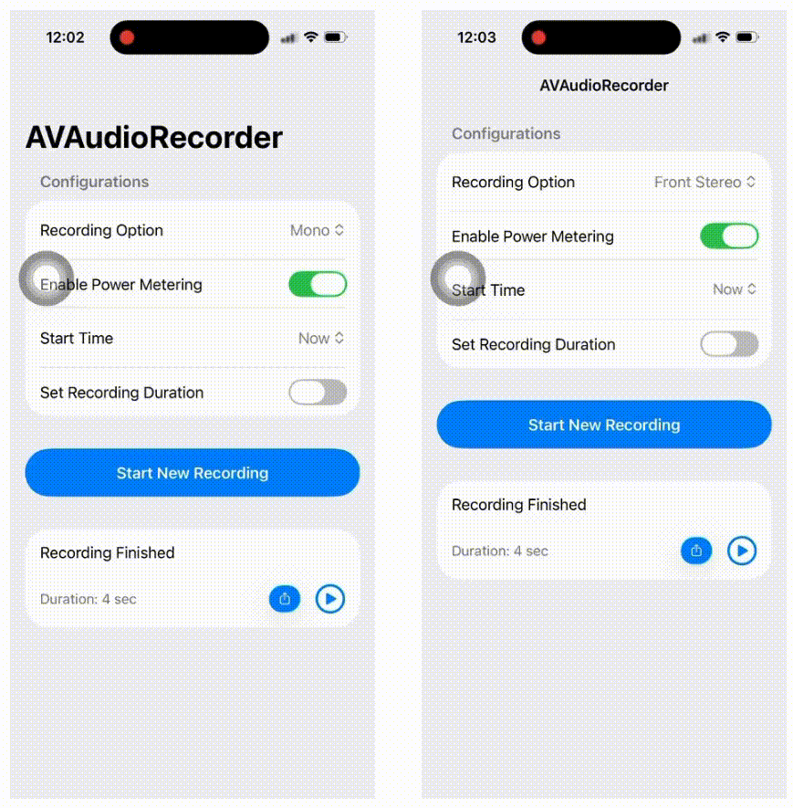

# Audio Recording Demo

A demo of using `AVAudioRecording` to record audio. 

Specifically, this demo includes

1. Start, stop, pause, resume regular(mono) recording
2. Start the recording at a specific time
3. Record for a specified duration or until the user stops it
4. Access recording-level metering data
5. Capturing stereo audio

In addition, to the recording capabilities above, it also includes 
- a simple share link to save or share the recording, as well as 
- a playback option implemented with `AVAudioPlayer`.

For more details, please check out my blog: [SwiftUI: Master Audio Recording With AVAudioRecorder](https://medium.com/@itsuki.enjoy/swiftui-master-audio-recording-with-avaudiorecorder-bb02a0da9a6a)

